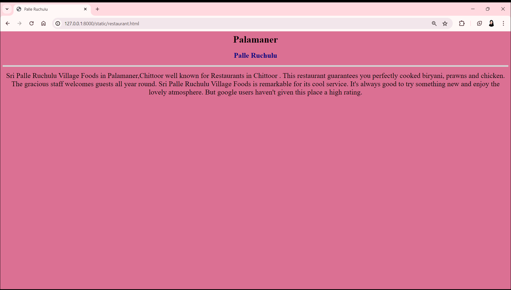

# Ex04 Places Around Me
## Date: 01/04/2024

## AIM
To develop a website to display details about the places around my house.

## DESIGN STEPS

### STEP 1
Create a Django admin interface.

### STEP 2
Download your city map from Google.

### STEP 3
Using ```<map>``` tag name the map.

### STEP 4
Create clickable regions in the image using ```<area>``` tag.

### STEP 5
Write HTML programs for all the regions identified.

### STEP 6
Execute the programs and publish them.

## CODE
```
map.html

<html>
<head>
<title>My City</title>
</head>
<body bgcolor="white">
<h1 align="center"><font color="CornFlowerBlue">Palamaner</font
h1>
<h3 align="center">
<font color="DodgerBlue">Sabeeha Shaik (212223230176)</font></h
<center>

<map name="MyCity">
<area shape="rect" coords="360,230,410,260" href="school.html" 
title="Narayana e-Techno School">     
<area shape="rect" coords="750,270,840,350" href="institution.
html" title="Mahed AL Uloom Al Islamia">
<area shape="rect" coords="400,600,510,650" href="restaurant.
html" title="Palle Ruchulu">
<area shape="rect" coords="1100,240,900,300" href="pond.html" 
title="Palamaner Pond">
<area shape="rect" coords="810,300,750,350" href="market.html" 
title="Palamaner Tomato Market">
</center>
</body>
</html>
```

```
school.html
<html>
<head>
<title>Narayana e-Techno</title>
</head>
<h1 align="center">
<font face="Times New Roman" color="black" size="6">Palamaner</
font>
</h1>
<h3 align="center">
<font face="Times New Roman" color="MidnightBlue" size="5.
5">Narayana e-Techno School</font>
</h3>
<body bgcolor="LightBlue" align="center">
<hr size="5" color="SteelBlue">
<p align="center">
<font face="Times New Roman" size="5.5">
The  Narayana e-techno School in Chittoor Palamaner, Andhra 
Pradesh  offers a 360-degree learning environment to its studen
and is rated as one of the best schools in Chittoor Palamaner, 
Andhra Pradesh. The school follows an integrated CBSE Syllabus 
which is equipped with a micro-schedule that defines preparatio
on an hour-to-hour basis and acts as an added advantage to 
students. Further, Narayana schools follow the best and top 
teaching methodologies to prepare students for JEE and NEET. 
These methods offer the best possible foundation and assistance
that help students perform exceptionally well in National 
competitive exams like Olympiad, JEE, NEET and others.
Narayana School in Chittoor Palamaner, Andhra Pradesh offers 
important concepts like nLearn that aids in Online test series,
nSports for curriculum oriented activities and Disha which aims
for overall student wellness.
It is these set of international standards followed at Narayana
e-Techno School that make’s it amongst the Top schools in 
Chittoor,Palamaner, Andhra Pradesh
</font>
</p>
</body>
</html>
```

```
institution.html

<html>
<head>
<title>Mahed AL Uloom Al Islamia</title>
</head>
<h1 align="center">
<font face="Times New Roman" color="black" size="6">Palamaner</
font>
</h1>
<h3 align="center">
<font face="Times New Roman" color="DarkBlue" size="5.5">Mahed 
Uloom Al Islamia</font>
</h3>
<body bgcolor="MediumTurquoise" align="center">
<hr size="5" color="Grey">
<p align="center">
<font face="Times New Roman" size="5.5">
The biggest madrasah of South India. It is located in a beautif
place. Hundreds of students get free of cost eduction there. It
is run by Al Maárif Trust, the biggest welfare NGO of South 
India. It is the madrasah where one of the most beautful mosque
of India, Masjid-e-Umm-e-Salma is located Bangalore Chennai 
Highway, Maseehabad, at outskirt of Palamaner about 134 Kms fro
Bangalore and 195km chennai (TN).
</font>
</p>
</body>
</html>

```

```
restaurant.html

<html>
<head>
<title>Palle Ruchulu</title>
</head>
<h1 align="center">
<font face="Times New Roman" color="black" size="6">Palamaner</
font>
</h1>
<h3 align="center">
<font face="Times New Roman" color="Navy" size="5.5">Palle 
Ruchulu</font>
</h3>
<body bgcolor="PaleVioletRed" align="center">
<hr size="5" color="LightGray">
<p align="center">
<font face="Times New Roman" size="5.5">
Sri Palle Ruchulu Village Foods in Palamaner,Chittoor well know
for Restaurants in Chittoor .
This restaurant guarantees you perfectly cooked biryani, prawns
and chicken. The gracious staff welcomes guests all year round.
Sri Palle Ruchulu Village Foods is remarkable for its cool 
service. It's always good to try something new and enjoy the 
lovely atmosphere. But google users haven't given this place a 
high rating.
</body>
</html>

```

```
pond.html

<html>
<head>
<title>Palamaner Pond</title>
</head>
<h1 align="center">
<font face="Times New Roman" color="black" size="6">Palamaner</
font>
</h1>
<h3 align="center">
<font face="Times New Roman" color="MidnightBlue" size="5.
5">Palle Ruchulu</font>
</h3>
<body bgcolor="Plum" align="center">
<hr size="5" color="steelBlue">
<p align="center">
<font face="Times New Roman" size="5.5">
Palamaner pond is a Natural Feature, located in Palamaner, Andh
Pradesh. It is one the oldest ponds. Government tried to arrang
boating facility for the people over there. But the drainage 
water from the locals polluted the pond. But the farmers use 
groundwater for cultivation of fields around it.
</body>
</html>
```

```
market.html

<html>
<head>
<title>Palamaner Tomato Market</title>
</head>
<h1 align="center">
<font face="Times New Roman" color="black" size="6">Palamaner 
Tomato Market</font>
</h1>
<h3 align="center">
<font face="Times New Roman" color="MediumPurple" size="5.
5">Palle Ruchulu</font>
</h3>
<body bgcolor="PeachPuff" align="center">
<hr size="5" color="Thistle">
<p align="center">
<font face="Times New Roman" size="5.5">
Palamaner Tomato Market in Chittoor is one of the leading 
businesses in the Tomato Retailers. Also known for potato 
Retailers, lady's finger Dealers,Green peas retailers,Cabbage 
Retailers,Tomato Retailers, Cauliflower Retailers, Brinjal 
retailers,Onion retailers and much more. Find Address, Contact 
number, Reviews & Ratings,Photos, maps of Palamaner tomato 
Market, Chittoor.</body>
</html>

```

## OUTPUT





## RESULT
The program for implementing image maps using HTML is executed successfully.
